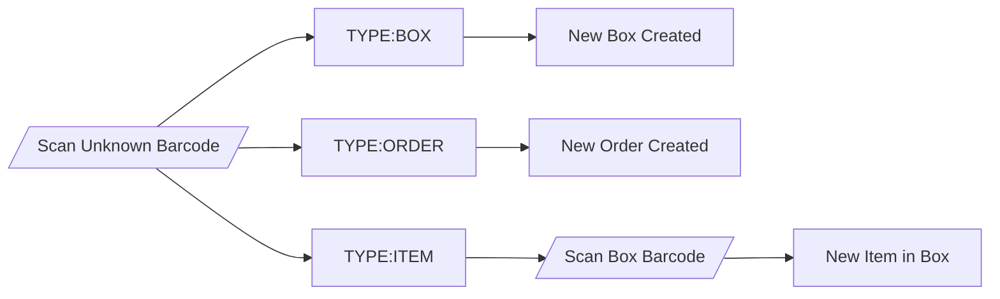
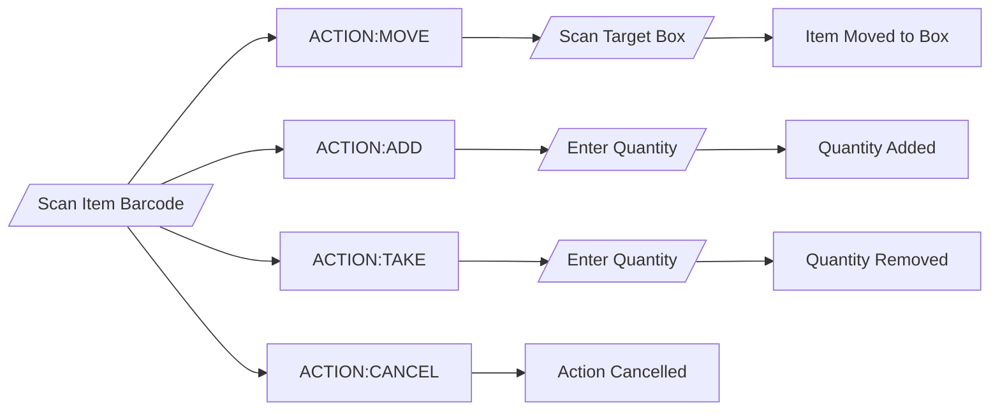
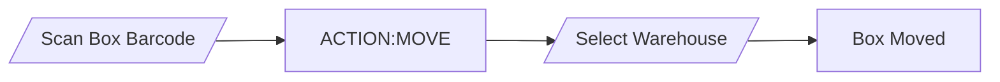
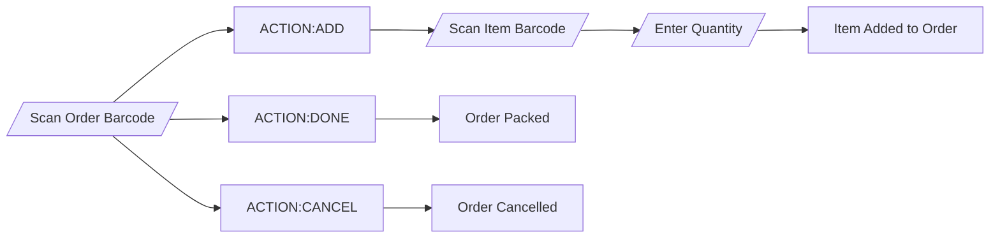
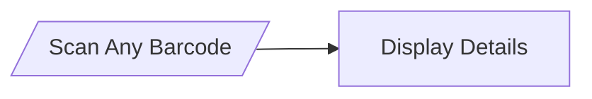

# Simple Inventory

## A simple story

Look, I was really tired when I wrote this (well, more "vibe-coded" than wrote), and I was looking for an inventory system for me & little company to track stuff. I have bought an old barcode reader and sticker printer in a discount store. 
I have tried many platforms, but everything was either too complex, too expensive, or without barcode support. So I have decided to write my own simple inventory system.
I have my room with a shelf. On the shelf, I have boxes with a lot of stuff to track. So this was going to be backbone of the system - Places, boxes & items. Also, i have started to print barcodes. A lot of them.
While writing this, I have realized that i will ned to quickly move items between boxes and I don't want to interact with computer since my scanner is wireless. So, action codes were born - scan item, then what to do and the third depends on the action. Even thought a catchy name - "Code chain".

## Operation & code chaining

> To be honest, the chaining is mos definetly a deformation from playing Factorio too much. But Factory must grow. I wonder if I can make a Factorio mod that would communicate with this app...

Code chain starts with item barcode. Either its known item or a new one. Refer to the charts below.

### Creating New Items



### Item Operations



### Box Operations



### Order Operations



### View Information



Other operations are very basic - Warehouses, Orders & Inventory checks.

### Warehouses

Well you wouldn't leave you paper boxes outside in the rain, right? Warehouses are just logical grouping for boxes, that's all.

### Orders

Orders are here when you sell something or want to take parts for a project. Scan code > order and add items. They will be removed from inventory and put into you order. When you are done, pack the order.
Also if you cancel it, all items can be returned to inventory.

### Inventory Checks

Inventory checks are here to help you with stocktaking. Create a new check, scan boxes and items. When done, you can compare the results with current inventory and make adjustments.
Also you can print them with barcodes on paper formanual check without a scanner. When you are back with results, just scan the printed barcodes & input the counts.


## Installation & setup

### Prerequisites

- Python 3.10 or higher
- A barcode scanner (optional, but recommended - any USB/wireless scanner that acts as keyboard input)
- A label printer for printing barcodes (optional and no, the app itself cannot print the barcodes... yet)

### Installation

1. **Clone the repository**
   ```bash
   git clone https://github.com/bublinak/simple-inventory.git
   cd simple-inventory
   ```

2. **Create a virtual environment**
   ```bash
   python -m venv .venv
   
   # Windows
   .venv\Scripts\activate
   
   # Linux/Mac
   source .venv/bin/activate
   ```

3. **Install dependencies**
   ```bash
   pip install -r requirements.txt
   ```

4. **Create the admin user**
   ```bash
   python scripts/create_admin.py
   ```
   This creates the database and an initial admin account:
   - Username: `admin`
   - Password: `admin123`
   
    **Please change this password after first login!**

5. **Run the server**
   ```bash
   uvicorn app.main:app --reload
   ```
   
   The application will be available at `http://localhost:8000`

### Configuration

The application uses SQLite by default (`inventory.db`). No additional database setup is required.

Environment variables can be set in a `.env` file:
- `SECRET_KEY` - JWT secret key (auto-generated if not set)
- `ACCESS_TOKEN_EXPIRE_MINUTES` - Token expiration time (default: 480 minutes)

### User Roles

- **Administrator** - Full access, can manage users and all data
- **Manager** - Can manage inventory, run inventory checks
- **Viewer** - Read-only access to inventory


## Contributing

GitHub Copilot (Claude Opus 4.5) & Me

## License

MIT License
